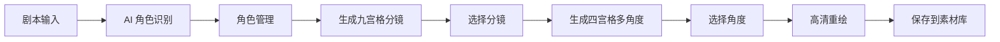
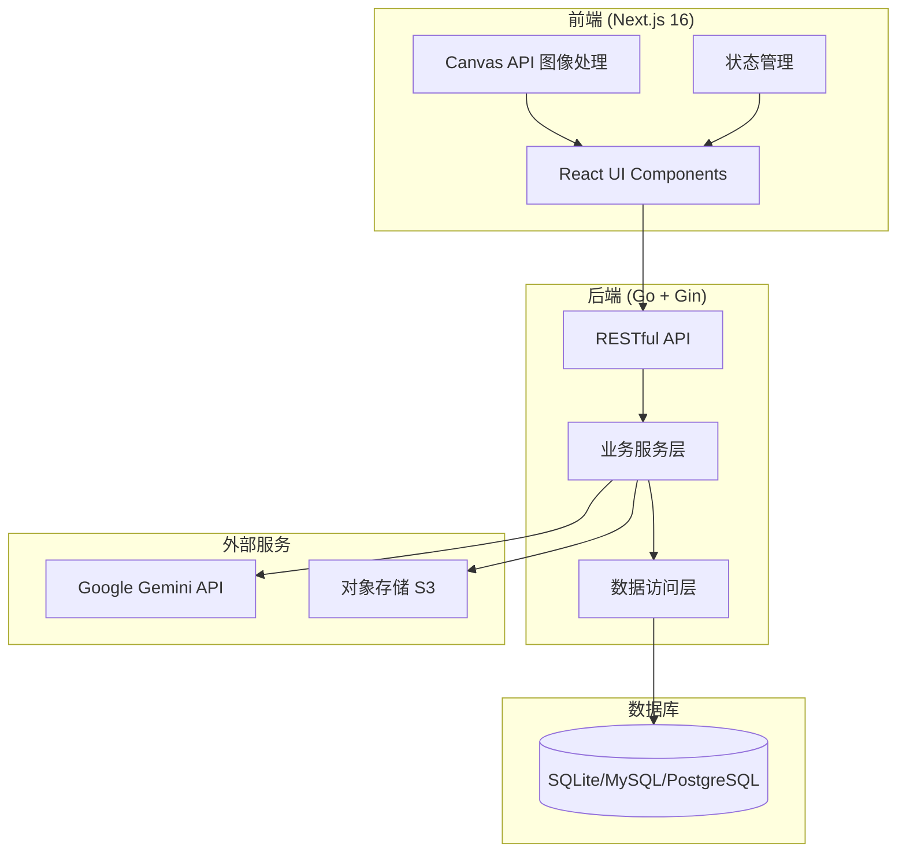
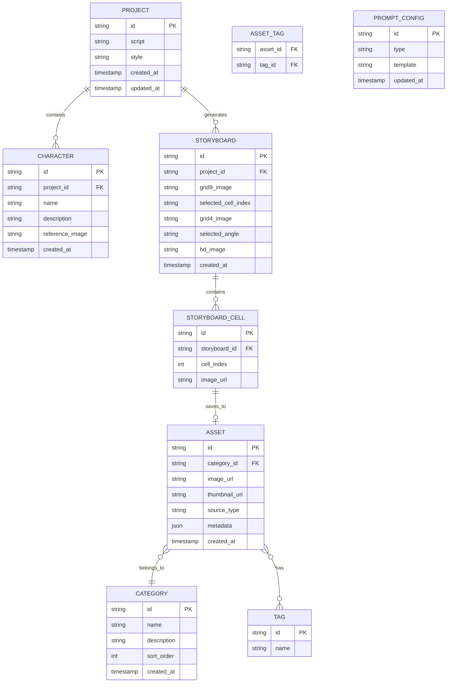

# Design Document: AI 分镜生成器

## Overview

AI 分镜生成器采用前后端分离架构，前端使用 Next.js 16 + TypeScript + Tailwind CSS 4，后端使用 Go + Gin + GORM。系统通过 RESTful API 通信，集成 Google Gemini AI 进行角色识别和图像生成，使用 Canvas API 进行图像分割处理。

### 核心工作流



## Architecture

### 系统架构图



### 前端架构

```
src/
├── app/                          # Next.js App Router
│   ├── storyboard/              # 分镜生成页面
│   │   └── page.tsx
│   ├── assets/                  # 素材库页面
│   │   └── page.tsx
│   └── layout.tsx
├── components/
│   ├── storyboard/
│   │   ├── ScriptInput.tsx      # 剧本输入组件
│   │   ├── StyleSelector.tsx    # 风格选择器
│   │   ├── CharacterList.tsx    # 角色列表
│   │   ├── CharacterCard.tsx    # 角色卡片
│   │   ├── GridNine.tsx         # 九宫格展示
│   │   ├── GridFour.tsx         # 四宫格展示
│   │   ├── HDPreview.tsx        # 高清预览
│   │   └── PromptConfig.tsx     # 提示词配置
│   ├── assets/
│   │   ├── AssetGrid.tsx        # 素材网格
│   │   ├── AssetCard.tsx        # 素材卡片
│   │   ├── CategoryFilter.tsx   # 分类筛选
│   │   └── TagSearch.tsx        # 标签搜索
│   └── ui/                      # 通用 UI 组件
├── lib/
│   ├── api.ts                   # API 客户端
│   ├── canvas.ts                # Canvas 图像处理
│   └── types.ts                 # TypeScript 类型定义
└── hooks/
    ├── useStoryboard.ts         # 分镜状态管理
    └── useAssets.ts             # 素材库状态管理
```

### 后端架构

```
internal/
├── handler/                     # HTTP 处理器
│   ├── storyboard.go
│   ├── character.go
│   ├── asset.go
│   └── prompt.go
├── service/                     # 业务逻辑
│   ├── script_parser.go         # 剧本解析
│   ├── image_generator.go       # 图像生成
│   ├── character.go             # 角色管理
│   ├── asset.go                 # 素材管理
│   └── storage.go               # 存储服务
├── repository/                  # 数据访问
│   ├── character.go
│   ├── asset.go
│   ├── category.go
│   └── prompt.go
├── model/                       # 数据模型
│   ├── character.go
│   ├── asset.go
│   ├── category.go
│   ├── tag.go
│   └── prompt.go
└── pkg/
    ├── gemini/                  # Gemini API 客户端
    │   ├── client.go
    │   ├── flash.go             # 2.5 Flash 文本分析
    │   └── image.go             # 3 Pro Image 图像生成
    └── storage/                 # 存储抽象
        ├── interface.go
        ├── s3.go
        └── local.go
```

## Components and Interfaces

### 前端组件接口

#### ScriptInput 组件
```typescript
interface ScriptInputProps {
  value: string;
  onChange: (script: string) => void;
  onAnalyze: () => void;
  isAnalyzing: boolean;
  disabled?: boolean;
}
```

#### CharacterCard 组件
```typescript
interface Character {
  id: string;
  name: string;
  description: string;
  referenceImage?: string;
}

interface CharacterCardProps {
  character: Character;
  onUpdate: (character: Character) => void;
  onDelete: (id: string) => void;
  onUploadImage: (id: string, file: File) => void;
  onGenerateImage: (id: string) => void;
  isGenerating: boolean;
}
```

#### GridNine 组件
```typescript
interface GridNineProps {
  imageUrl: string | null;
  cells: string[];  // 分割后的 9 个图像 URL
  selectedIndex: number | null;
  onSelect: (index: number) => void;
  isLoading: boolean;
}
```

#### GridFour 组件
```typescript
interface GridFourProps {
  cells: {
    url: string;
    angle: 'wide' | 'medium' | 'close' | 'extreme';
    label: string;  // 远景、中景、近景、特写
  }[];
  selectedIndex: number | null;
  onSelect: (index: number) => void;
  isLoading: boolean;
}
```

#### AssetCard 组件
```typescript
interface Asset {
  id: string;
  imageUrl: string;
  thumbnailUrl: string;
  categoryId: string;
  categoryName: string;
  tags: string[];
  createdAt: string;
}

interface AssetCardProps {
  asset: Asset;
  onView: (id: string) => void;
  onEdit: (id: string) => void;
  onDelete: (id: string) => void;
}
```

### 后端 API 接口

#### 角色识别 API
```
POST /api/v1/storyboard/analyze
Request:
{
  "script": "string",
  "style": "string"
}
Response:
{
  "characters": [
    {
      "name": "string",
      "description": "string"
    }
  ]
}
```

#### 角色参考图生成 API
```
POST /api/v1/characters/{id}/generate-image
Request:
{
  "script": "string",
  "characterName": "string",
  "characterDescription": "string"
}
Response:
{
  "imageUrl": "string"
}
```

#### 九宫格分镜生成 API
```
POST /api/v1/storyboard/generate-grid9
Request:
{
  "script": "string",
  "style": "string",
  "characters": [
    {
      "name": "string",
      "referenceImage": "string"
    }
  ],
  "promptTemplate": "string"
}
Response:
{
  "imageUrl": "string"
}
```

#### 四宫格多角度生成 API
```
POST /api/v1/storyboard/generate-grid4
Request:
{
  "sourceImage": "string",
  "cellIndex": number,
  "mainCharacter": "string",
  "promptTemplate": "string"
}
Response:
{
  "imageUrl": "string"
}
```

#### 高清重绘 API
```
POST /api/v1/storyboard/hd-redraw
Request:
{
  "sourceImage": "string",
  "angle": "wide" | "medium" | "close" | "extreme",
  "promptTemplate": "string"
}
Response:
{
  "imageUrl": "string"
}
```

#### 素材库 API
```
GET /api/v1/assets?category={categoryId}&tags={tag1,tag2}&page={page}&size={size}
POST /api/v1/assets
PUT /api/v1/assets/{id}
DELETE /api/v1/assets/{id}

GET /api/v1/categories
POST /api/v1/categories
PUT /api/v1/categories/{id}
DELETE /api/v1/categories/{id}
```

### Canvas 图像处理接口

```typescript
// lib/canvas.ts

/**
 * 将图像分割为九宫格
 */
function splitToGrid9(imageUrl: string): Promise<string[]>;

/**
 * 将图像分割为四宫格
 */
function splitToGrid4(imageUrl: string): Promise<string[]>;

/**
 * 从 Canvas 导出图像为 Blob
 */
function canvasToBlob(canvas: HTMLCanvasElement, type?: string, quality?: number): Promise<Blob>;
```

## Data Models

### 数据库 ER 图



### Go 数据模型

```go
// model/character.go
type Character struct {
    ID             string    `gorm:"primaryKey"`
    ProjectID      string    `gorm:"index"`
    Name           string    `gorm:"size:100"`
    Description    string    `gorm:"type:text"`
    ReferenceImage string    `gorm:"size:500"`
    CreatedAt      time.Time
}

// model/asset.go
type Asset struct {
    ID           string    `gorm:"primaryKey"`
    CategoryID   string    `gorm:"index"`
    Category     Category  `gorm:"foreignKey:CategoryID"`
    ImageURL     string    `gorm:"size:500"`
    ThumbnailURL string    `gorm:"size:500"`
    SourceType   string    `gorm:"size:50"` // grid9, grid4, hd
    Metadata     JSON      `gorm:"type:json"`
    Tags         []Tag     `gorm:"many2many:asset_tags"`
    CreatedAt    time.Time
}

// model/category.go
type Category struct {
    ID          string `gorm:"primaryKey"`
    Name        string `gorm:"size:100;uniqueIndex"`
    Description string `gorm:"size:500"`
    SortOrder   int    `gorm:"default:0"`
    CreatedAt   time.Time
}

// model/tag.go
type Tag struct {
    ID   string `gorm:"primaryKey"`
    Name string `gorm:"size:50;uniqueIndex"`
}

// model/prompt.go
type PromptConfig struct {
    ID        string `gorm:"primaryKey"`
    Type      string `gorm:"size:50;uniqueIndex"` // grid9, grid4, hd
    Template  string `gorm:"type:text"`
    UpdatedAt time.Time
}
```

### TypeScript 类型定义

```typescript
// lib/types.ts

interface Project {
  id: string;
  script: string;
  style: string;
  characters: Character[];
  createdAt: string;
}

interface Character {
  id: string;
  projectId: string;
  name: string;
  description: string;
  referenceImage?: string;
}

interface Storyboard {
  id: string;
  projectId: string;
  grid9Image?: string;
  grid9Cells: string[];
  selectedCellIndex?: number;
  grid4Image?: string;
  grid4Cells: AngleCell[];
  selectedAngle?: AngleType;
  hdImage?: string;
}

interface AngleCell {
  url: string;
  angle: AngleType;
  label: string;
}

type AngleType = 'wide' | 'medium' | 'close' | 'extreme';

interface Asset {
  id: string;
  categoryId: string;
  categoryName: string;
  imageUrl: string;
  thumbnailUrl: string;
  sourceType: 'grid9' | 'grid4' | 'hd';
  tags: string[];
  metadata: Record<string, unknown>;
  createdAt: string;
}

interface Category {
  id: string;
  name: string;
  description?: string;
  sortOrder: number;
  assetCount?: number;
}

interface PromptConfig {
  id: string;
  type: 'grid9' | 'grid4' | 'hd';
  template: string;
}

interface PromptVariables {
  style?: string;
  characters?: string;
  script?: string;
  cellIndex?: number;
  mainCharacter?: string;
}
```


## Correctness Properties

*A property is a characteristic or behavior that should hold true across all valid executions of a system—essentially, a formal statement about what the system should do. Properties serve as the bridge between human-readable specifications and machine-verifiable correctness guarantees.*


### Property 1: 输入状态同步

*For any* 用户输入（剧本内容、角色名称、风格设置等），输入后的状态应与用户输入值完全一致。

**Validates: Requirements 1.3, 3.4**

### Property 2: 空输入验证

*For any* 空字符串或仅包含空白字符的剧本输入，"AI 角色识别"按钮应处于禁用状态。

**Validates: Requirements 1.4**

### Property 3: 角色解析结构完整性

*For any* 有效的 AI 角色识别响应，解析后的每个角色对象必须包含 `name` 和 `description` 字段。

**Validates: Requirements 2.2**

### Property 4: 角色列表 CRUD 操作

*For any* 角色列表：
- 添加角色后，列表长度增加 1
- 删除角色后，列表长度减少 1，且不包含被删除的角色
- 编辑角色后，角色信息与编辑值一致

**Validates: Requirements 3.1, 3.2, 3.3**

### Property 5: 图像上传返回有效 URL

*For any* 有效的图片文件上传，Storage_Service 应返回一个可访问的 URL。

**Validates: Requirements 4.2**

### Property 6: 网格图像分割

*For any* 有效的图像：
- 九宫格分割后应得到恰好 9 个子图像
- 四宫格分割后应得到恰好 4 个子图像
- 每个子图像的尺寸应为原图的 1/3（九宫格）或 1/2（四宫格）

**Validates: Requirements 5.2, 6.3**

### Property 7: 四宫格角度标注完整性

*For any* 四宫格多角度视图，必须包含且仅包含四种角度标注：远景(wide)、中景(medium)、近景(close)、特写(extreme)。

**Validates: Requirements 6.4**

### Property 8: 提示词模板变量替换

*For any* 包含 `{{变量名}}` 格式占位符的模板和对应的变量值，替换后的结果应不包含任何未替换的占位符，且变量值被正确插入。

**Validates: Requirements 8.3**

### Property 9: 提示词配置持久化

*For any* 提示词配置，保存后重新加载应得到完全相同的配置内容。

**Validates: Requirements 8.4**

### Property 10: 存储服务一致性

*For any* 有效的图像数据和存储模式（S3 或本地）：
- 上传应成功并返回 URL
- 返回的 URL 应可访问到原始图像
- 两种存储模式应提供相同的接口行为

**Validates: Requirements 9.1, 9.2, 9.3**

### Property 11: 素材库标签功能

*For any* 素材和任意数量的标签（0 到多个），保存后应能通过任意一个标签检索到该素材。

**Validates: Requirements 10.3**

### Property 12: 素材库 CRUD 和检索

*For any* 素材库操作：
- 保存素材后，应能通过 ID 检索到相同的数据
- 按分类筛选应只返回该分类的素材
- 按标签搜索应返回包含该标签的所有素材
- 删除素材后，该素材应不可检索
- 编辑素材后，检索应返回更新后的值

**Validates: Requirements 10.4, 10.5, 10.6, 10.8**

### Property 13: 响应式布局适配

*For any* 屏幕尺寸（移动端、平板、桌面），页面布局应正确适配，不出现内容溢出或重叠。

**Validates: Requirements 11.5**

## Error Handling

### 前端错误处理

1. **网络错误**：显示友好的错误提示，提供重试按钮
2. **AI 生成超时**：设置合理的超时时间（60s），超时后提示用户重试
3. **图片上传失败**：显示具体错误原因，支持重新选择文件
4. **Canvas 处理失败**：降级处理，显示原始图像

### 后端错误处理

1. **Gemini API 错误**：
   - 速率限制：实现指数退避重试
   - 内容过滤：返回友好提示，建议修改输入
   - 服务不可用：返回 503 状态码，前端显示维护提示

2. **存储服务错误**：
   - 上传失败：重试 3 次，失败后返回错误
   - 存储空间不足：返回具体错误信息

3. **数据库错误**：
   - 连接失败：使用连接池，自动重连
   - 事务失败：回滚并返回错误

### 错误响应格式

```json
{
  "error": {
    "code": "ERROR_CODE",
    "message": "用户友好的错误信息",
    "details": "技术细节（仅开发环境）"
  }
}
```

## Testing Strategy

### 单元测试

使用 Jest（前端）和 Go testing（后端）进行单元测试：

- **前端**：测试组件渲染、状态管理、Canvas 处理函数
- **后端**：测试业务逻辑、数据验证、模板解析

### 属性测试

使用 fast-check（前端）和 gopter（后端）进行属性测试：

- 每个属性测试运行至少 100 次迭代
- 测试标注格式：`**Feature: ai-storyboard-generator, Property N: 属性描述**`

### 集成测试

- API 端到端测试
- Gemini API Mock 测试
- 存储服务集成测试

### 测试覆盖率目标

- 单元测试覆盖率：≥ 80%
- 属性测试覆盖所有核心属性
- 集成测试覆盖主要工作流
